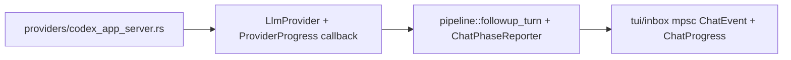

# Codex App-Server Transition + Setup Cleanup Plan

## Summary

Replace the current `codex exec` subprocess path with a persistent Codex app-server integration for `LLM_PROVIDER=codex`, keeping `codex exec` as an explicit fallback (`CODEX_TRANSPORT=exec`). Goals: lower inbox chat latency (no per-turn process startup/resume), streamed provider progress in the inbox UI, and Codex auth owned by `triage-cli setup` / `doctor` via ChatGPT app-server endpoints.

Official app-server flow: spawn `codex app-server --listen stdio://`, `initialize`, `account/read`, device-code login in setup, then `thread/start` / `thread/resume` and `turn/start` for follow-up turns.

**Targets:** `triage-cli/triage-cli-rs` only (not Remotion demo).

## Transport scope (v1 decision)

| Surface | v1 behavior | Rationale |
| --- | --- | --- |
| `LlmProvider::followup` (inbox chat) | `CODEX_TRANSPORT=app-server` when available | Primary latency win; thread resume |
| `LlmProvider::complete` (`triage_structured`, anchor/site extraction) | Stays on `CODEX_TRANSPORT=exec` subprocess | Avoids blocking v1 on structured-output parity over app-server; document clearly |
| Fallback | Any app-server init/auth/runtime failure → user-readable error; operators can set `CODEX_TRANSPORT=exec` | Safe rollback without changing `LLM_PROVIDER` |

**Follow-up (v2):** migrate `complete()` to the shared app-server client once structured JSON turns are validated on `thread/start` + `turn/start`.

## Coordination with inbox chat revamp

Do **not** build a parallel TUI progress stack. Layer on the existing design in `docs/superpowers/plans/2026-05-20-inbox-chat-revamp.md`:

- **Provider layer:** map `item/agentMessage/delta` → `ProviderProgress::TextDelta`; pipeline stages → existing `ChatStage` via `ChatPhaseReporter` (optional `None` for CLI callers).
- **Deprecate in this plan:** standalone `FollowupEvent` at the TUI boundary and `followup_turn_with_progress` as a public duplicate API — use `followup_turn(..., reporter: Option<&dyn ChatPhaseReporter>)` plus internal progress callback from the app-server client.
- **Replace** `InFlightState` with `ChatProgress` per the inbox revamp plan; today `in_flight` is never set in `send_analyst_turn` — fix that in the same work.

## Key Changes

### 1. Persistent Codex app-server client

- New module: `triage-cli-rs/src/providers/codex_app_server.rs` (or split transport + session if it grows past ~450 LOC).
- **Singleton** child: spawn `codex app-server --listen stdio://` lazily on first Codex app-server call; register process exit cleanup (`Drop` / `ctrlc` path as appropriate).
- JSON-RPC over stdio: request IDs, notification dispatch, timeouts, child death → `ProviderError::Transport` with respawn-or-fail policy (one respawn attempt per turn, then surface error).
- Methods: `initialize`, `account/read`, `account/login/start`, `model/list`, `thread/start`, `thread/resume`, `turn/start`.
- Aggregate `item/agentMessage/delta` into response text; finish on `turn/completed`.
- Overload `-32001`: retry with exponential backoff + jitter (max 3 attempts, cap 8s; do not retry other JSON-RPC errors).
- Map notifications and errors to existing `ProviderError` variants (`Transport`, `SubprocessMissing`, `SubprocessFailure`, readable auth/model messages).

### 2. Provider selection

- Keep `LLM_PROVIDER=codex`.
- Add `CODEX_TRANSPORT=app-server|exec`.
- **Default:** `app-server` only when `doctor`-style capability probe passes (`codex` on PATH + `initialize` succeeds); otherwise setup writes `CODEX_TRANSPORT=exec` and prints a yellow hint.
- `get_provider()` in `providers/mod.rs`: dispatch `CodexAppServerProvider` vs `CodexSubprocessProvider` (rename current `CodexSubprocessProvider` from inline struct if needed).
- Preserve `CODEX_MODEL` / `DEFAULT_CODEX_MODEL` (`gpt-5.5`); no model migration.

### 3. Session provenance and thread-ID migration

- Old `SessionManifest` JSON remains deserializable (`#[serde(default)]` on new fields).
- Optional manifest fields:
  - `codex_thread_id` — canonical resumable thread (mirror of latest provider turn when using app-server)
  - `codex_transport` — `app-server` | `exec` recorded at session creation
  - `codex_capture_method` — add `app_server_thread_id`; keep `codex_json_output` for exec path
- **Do not add `codex_session_id`** unless a distinct ID emerges from app-server events; `Turn.session_id` + `codex_thread_id` are sufficient for v1.
- Store resumable `thread.id` in `Turn.session_id` (unchanged follow-up logic in `pipeline/followup.rs`).
- **Mixed transport on one ticket:** if manifest has `codex_transport=exec` but env is `app-server` (or vice versa), do not assume IDs are interchangeable — follow existing provider-mismatch rules (replay banner per `docs/superpowers/specs/2026-05-17-interactive-investigation-design.md`; native resume only when manifest provider and transport align).
- Initial `investigate` / `triage` structured run: continues to capture session via exec JSON-Lines contract until v2; inbox follow-ups on the same ticket may use app-server threads independently.

### 4. Inbox chat non-blocking (with inbox revamp)

Current gap: `tui/inbox/chat.rs` awaits `followup_turn` synchronously; `in_flight` is never populated.

1. On send (after analyst turn append under lock): set `ChatProgress` / `in_flight`, spawn `tokio::task` running `followup_turn(..., Some(reporter))`.
2. Main loop (80ms poll): drain `mpsc::UnboundedReceiver<ChatEvent>`, update `ChatProgress`, optional draft text from `TextDelta`.
3. On completion: persist provider turn (inside `followup_turn`), clear `in_flight`, refresh transcript.
4. Reject or ignore second send while `in_flight` is set; document that `followup_turn` holds `.session/lock` for the provider leg — `/revise` and concurrent sends remain blocked until the turn finishes (acceptable for v1).
5. No `turn/interrupt` in v1; status copy must not imply cancel works.

### 5. Setup and doctor

- Make `setup()` async; invoke from `cli` on the existing Tokio runtime (replace sync `setup()` entry).
- When user selects Codex: write `LLM_PROVIDER=codex` and `CODEX_TRANSPORT=app-server` (or `exec` if probe fails), then run device-code flow if `account/read` is unauthenticated.
- Device-code UX: print `verificationUrl` + `userCode`, poll/wait for `account/login/completed`; never write OAuth tokens into `.env`.
- Idempotent setup: if already authenticated, skip login and confirm via `account/read`.
- `doctor` (read-only): `codex` on PATH; minimum CLI supports `app-server` subcommand; `initialize` + `account/read` authenticated; `CODEX_MODEL` (or default) present in `model/list`; on failure, print “run `triage-cli setup`” — **do not** start login.
- Unleash setup/doctor paths unchanged.

## Public Interfaces / Types

| Item | Detail |
| --- | --- |
| `CODEX_TRANSPORT` | `app-server` \| `exec`; default `app-server` when capable |
| `ProviderProgress` (internal) | `Stage { label }`, `TextDelta { text }`, `Error { message }` — bridged to `ChatEvent` / `ChatStage`, not exposed as a second public TUI API |
| `SessionManifest` | optional `codex_thread_id`, `codex_transport`; `codex_capture_method` includes `app_server_thread_id` |
| Unchanged | `LLM_PROVIDER=codex`, `CODEX_MODEL`, `CONVERSATION.jsonl`, `Turn.session_id` |

## File map

| Path | Change |
| --- | --- |
| `src/providers/codex_app_server.rs` | New JSON-RPC client + singleton process |
| `src/providers/codex.rs` | Rename subprocess impl; keep exec resume/JSON contract |
| `src/providers/mod.rs` | `CODEX_TRANSPORT` dispatch; `ProviderProgress` callback type |
| `src/pipeline/followup.rs` | Optional `ChatPhaseReporter`; document lock scope |
| `src/tui/inbox/chat.rs` | Spawn async turn; wire `ChatProgress` + mpsc |
| `src/chat.rs` | `ChatEvent`, `ChatPhaseReporter` (per inbox revamp) |
| `src/setup.rs` | Async setup + Codex auth probe |
| `tests/codex_contract.rs` | Split exec vs app-server; `CODEX_AVAILABLE=1` gate |
| `docs/adr/` | New ADR: app-server default + transport env |
| `docs/decisions/2026-05-17-codex-session-capture.md` | Note exec contract still used for `complete()` in v1 |
| `README.md`, `docs/runbooks/01`, `04`, `05`, `CLAUDE.md`, `AGENTS.md` | Document transport, setup auth, troubleshooting |

## Implementation phases

| Phase | Deliverable | Est. LOC |
| --- | --- | --- |
| 0 | Fake stdio transport tests; `CODEX_AVAILABLE` smoke for `initialize` | ~150 tests |
| 1 | `codex_app_server.rs` + `get_provider()` + overload retry | ~350 |
| 2 | Async `setup` / `doctor` auth + version gate | ~150 |
| 3 | `followup` on app-server + manifest fields | ~120 |
| 4 | Inbox async + inbox revamp (`ChatProgress`, mpsc, reporter) | ~200 (overlap with existing plan) |
| 5 | Docs, ADR, runbooks, `.env.example` | — |
| v2 | `complete()` on app-server | separate plan |

**Regression gates:** `cargo test --lib`, `cargo test --test pipeline_integration`, `cargo clippy --all-targets -- -D warnings`.

**CI:** default `CODEX_TRANSPORT=exec` in CI when app-server is unavailable; optional job with `CODEX_AVAILABLE=1`.

## Test Plan

### App-server unit (fake transport)

- `initialize` required before other requests
- device-code login success/failure notifications
- `thread/start` vs `thread/resume`
- delta aggregation through `turn/completed`
- `-32001` retry then failure after max attempts
- child process death → respawn or clear error

### Provider

- `LLM_PROVIDER=codex` + default → app-server when probe passes
- `CODEX_TRANSPORT=exec` → subprocess only
- first follow-up returns thread ID; second resumes
- manifest with `codex_transport=exec` + env `app-server` → defined replay/mismatch behavior
- auth/model errors human-readable

### Setup / doctor

- `doctor` does not mutate auth; fails when unauthenticated
- setup device-code success; no tokens in `.env`
- `doctor` fails when `codex` lacks `app-server` subcommand (upgrade hint)
- setup skips login when already authenticated
- Unleash paths unchanged

### Inbox

- send sets `in_flight` / `ChatProgress` before spawn returns
- progress events update banner/draft
- completion clears `in_flight` and writes Codex turn
- second send rejected while active
- lock + `in_flight` both block overlapping operations (documented)

### Contract / integration

- Existing `tests/codex_contract.rs` remains exec-only
- New `tests/codex_app_server_contract.rs` (or module) gated on `CODEX_AVAILABLE=1`
- pipeline_integration follow-up tests updated for app-server mock

## Assumptions

- Terminal-first setup → ChatGPT device-code auth is the default.
- WebSocket app-server transport is out of scope for v1; stdio is sufficient.
- `turn/interrupt` deferred until streaming + auth are stable.
- Inbox UX details (banner tiers, `/dir`, `chat-events.log`) follow `docs/superpowers/plans/2026-05-20-inbox-chat-revamp.md`; this plan only adds app-server + auth + transport scope.

## Deferred (explicitly out of v1)

- `LlmProvider::complete` on app-server
- `turn/interrupt` / cancel UX
- WebSocket transport
- Writing OAuth secrets to `.env`
