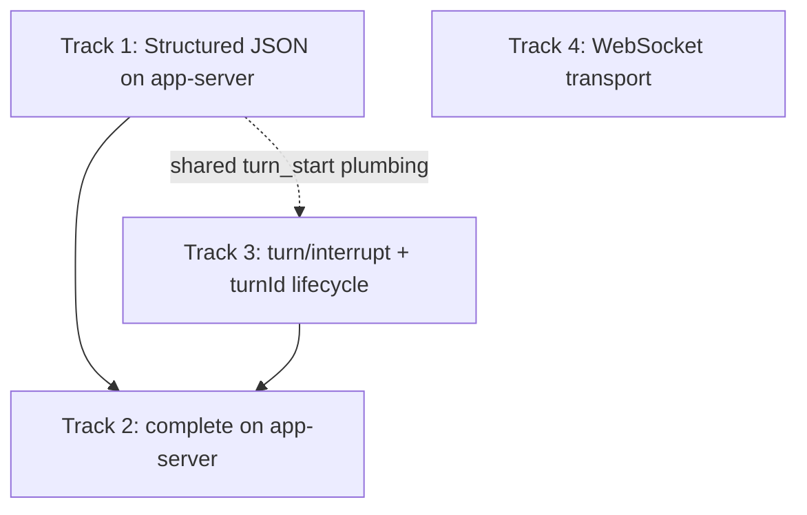

# Codex App-Server v2 — Structured Turns, `complete()`, Interrupt, WebSocket

## Summary

v1 ([`2026-05-25-codex-app-server-transition.md`](./2026-05-25-codex-app-server-transition.md), [ADR 0004](../../adr/0004-codex-app-server-transport.md)) moved **inbox `followup`** onto a persistent stdio app-server client. Four items were explicitly deferred. This plan sequences them so structured-output parity lands before routing `complete()` through app-server, and so **server-side cancel** is real before inbox copy claims “Esc to cancel.”

**Prerequisite:** v1 merged (PR #48 or equivalent): `CodexAppServerProvider`, `AppServerTransport`, `thread/start` + `turn/start` follow-up path, manifest `codex_thread_id` / `codex_transport`, async setup/doctor.

**Targets:** `triage-cli/triage-cli-rs` only.

**References (Codex upstream):**

- [App Server docs](https://developers.openai.com/codex/app-server) — `turn/start` supports `outputSchema`; `turn/interrupt` takes `threadId` + `turnId`; `turn/completed` status includes `interrupted`.
- [codex-rs/app-server/README.md](https://github.com/openai/codex/blob/main/codex-rs/app-server/README.md) — notification stream, turn lifecycle.

---

## v1 baseline (what v2 builds on)

| Surface | v1 behavior |
| --- | --- |
| `LlmProvider::followup` | App-server when `CODEX_TRANSPORT` + probe succeed; else exec |
| `LlmProvider::complete` | **Always** delegated to `CodexSubprocessProvider` inside `CodexAppServerProvider` (`codex_app_server.rs` ~L901–908) |
| Transport | `StdioAppServerTransport` only (`codex app-server --listen stdio://`) |
| Inbox cancel | `tokio::task::abort()` on the spawned follow-up task; **no** `turn/interrupt`; Codex may keep generating |
| Structured triage | `llm::triage_structured` → `provider.complete()` → plain `codex exec` stdout (no `--json` on `complete()` path today) |
| Session capture | Exec: `codex_json_output`; app-server follow-up: `app_server_thread_id` — not interchangeable |

---

## Dependency graph



**Recommended order:** Track 1 → Track 3 (partial overlap with 1) → Track 2. Track 4 is a post-core optional task and must not gate Tracks 1–3.

Track 4 is **not** required for Tracks 1–3; it enables remote/long-lived daemons and drops subprocess stdio coupling. Upstream currently marks WebSocket app-server transport experimental / unsupported, so it must remain opt-in and off the critical path.

---

## Track 1 — Structured JSON turns (`outputSchema` on `thread/start` + `turn/start`)

### Problem

`triage_structured`, `extract_anchor`, and `extract_site` need a **single assistant message** that parses as JSON (`StructuredTriageReport`, anchor/site structs). v1 relies on `codex exec` plus prompt discipline; app-server follow-ups use free-text `turn/start` without schema enforcement.

### Goal

Prove app-server can produce validator-grade JSON at least as reliably as exec, using Codex **`outputSchema`** (JSON Schema object) on turn params, before switching `LlmProvider::complete`.

### Design

1. **Schema builder** — `providers/codex_schema.rs` (or module in `codex_app_server.rs` if &lt; ~200 LOC):
   - `structured_triage_output_schema() -> Value` — minimal JSON Schema for `StructuredTriageReport` (required top-level keys matching `llm::try_parse_and_validate` expectations).
   - `anchor_output_schema()`, `site_output_schema()` — smaller schemas for extraction calls in `llm.rs`.
   - Version tag in schema `description` or `$id` string for debugging (`triage-cli/structured-triage/v1`).

2. **Turn API extension** — extend `CodexAppServerClient`:
   - `turn_start_collect(thread_id, input, model, output_schema: Option<Value>) -> TurnOutput` where `TurnOutput` holds `{ thread_id, turn_id, text, tokens_in, tokens_out, status }`.
   - `turn/start` returns the initial turn object in the synchronous response on Codex CLI 0.133.0; use that as the primary source for `turn.id`, and also tolerate / reconcile the later `turn/started` notification.
   - On `turn/completed`, collect final assistant text from:
     - **Preferred:** structured item payload if app-server emits JSON in `item/completed` for schema-constrained turns (verify against live CLI).
     - **Fallback:** aggregate `item/agentMessage/delta` then `serde_json::from_str` on full body (same as today’s exec path).
   - Token counts are not part of the generated `TurnCompletedNotification` schema on Codex CLI 0.133.0; capture them opportunistically from `thread/tokenUsage/updated` events keyed by `(threadId, turnId)`.

3. **Ephemeral threads for one-shot `complete()`** — `thread/start` with `ephemeral: true` (per upstream docs) for structured calls that do not need inbox resume:
   - Avoid polluting ticket `codex_thread_id` unless caller opts in.
   - Optional env `CODEX_STRUCTURED_EPHEMERAL=1` (default true for `complete()`).

4. **Prompt shape** — keep the current semantic split but do **not** double-stamp:
   - Exec path continues to combine into `## System` / `## User` because `codex exec` accepts one prompt argument.
   - App-server path sends `system_prompt` as `baseInstructions` on `thread/start` and the user prompt as `input: [{ type: "text", text }]` on `turn/start`.
   - Document the chosen app-server wire format in `triage-cli-rs/docs/decisions/2026-05-17-codex-session-capture.md`.

5. **Parity harness** — new test binary or module `tests/codex_structured_parity.rs` (gated `CODEX_AVAILABLE=1`):
   - Fixed minimal bundle fixture + rubric slice.
   - Run same prompt through exec `complete()` and app-server structured turn.
   - Assert both parse to `StructuredTriageReport` and pass rubric validator (soft-warn allowed).
   - Record flake rate; gate Track 2 on N≥10 green runs locally.

### Acceptance criteria

- [ ] Fake-transport tests: `outputSchema` in `turn/start` params; `turn/completed` with JSON body parsed.
- [ ] Live contract: structured turn returns parseable `StructuredTriageReport` for canned fixture ≥90% over 10 runs (document failures).
- [ ] Decision doc updated: app-server structured capture method name (e.g. `app_server_output_schema`).

### Est. LOC: ~400 (client + schemas + tests)

---

## Track 2 — `LlmProvider::complete()` on app-server

### Problem

Every `investigate` / `triage` / anchor / site call still spawns `codex exec`, paying process startup cost and maintaining two auth/sandbox paths when inbox already uses app-server.

### Goal

When `CODEX_TRANSPORT=app-server` and structured parity gate passes, `CodexAppServerProvider::complete()` uses the shared singleton client (Track 1), with **exec fallback** unchanged for rollback.

### Design

1. **Implement the provider API without hiding retry ownership**:
   - Keep `LlmProvider::complete(prompt, system_prompt, model)` as the public trait method.
   - Add an internal Codex app-server helper, `complete_via_app_server(prompt, system_prompt, model, output_schema: Option<Value>)`, used only by `CodexAppServerProvider`.
   - Select the schema at the Codex provider boundary from the system prompt / call shape:
     - structured triage prompt → `structured_triage_output_schema()`
     - `SITE_EXTRACTION_PROMPT` → `site_output_schema()`
     - `ANCHOR_EXTRACTION_PROMPT` → `anchor_output_schema()`
     - unknown prompt → `None`
   - Return the raw assistant text in `CompletionResult` even when parsing fails. `llm::triage_structured`, `extract_site`, and `extract_anchor` keep parse and retry ownership exactly as today.
   - Populate token counts only when a matching `thread/tokenUsage/updated` notification was observed; otherwise keep `None`.

2. **Env / feature flag** — `CODEX_COMPLETE_TRANSPORT=app-server|exec|auto`:
   - `auto` defaults to **exec** until the parity harness has a checked-in passing evidence note; after that, auto may prefer app-server when probe passes.
   - v1 behavior preserved when `CODEX_COMPLETE_TRANSPORT=exec` or global `CODEX_TRANSPORT=exec`.

3. **Session provenance for initial triage** — when structured `complete()` creates a resumable thread (non-ephemeral):
   - Capture `thread.id` on first provider turn of investigate (same as exec `codex_json_output` today) **only if** product wants investigate→chat resume on one thread — **decision point:**
     - **Option A (recommended):** keep investigate structured on **ephemeral** thread; inbox follow-up starts/resumes separate `codex_thread_id` (current mental model).
     - **Option B:** single thread for ticket — requires `thread/resume` before first inbox follow-up and aligned `baseInstructions`.

4. **Remove double spawn** — `get_provider()` should not spawn extra probe per `complete()`; reuse cached effective transport (`OnceLock` from v1).

5. **Docs / ADR** — amend ADR 0004 or add ADR 0005: `complete()` surface split closed; CI default remains `CODEX_TRANSPORT=exec` until optional structured job exists.

### Call sites (unchanged signatures)

| Caller | File |
| --- | --- |
| `triage_structured` | `llm.rs` |
| Site extraction | `llm.rs` |
| Anchor extraction | `llm.rs` |

### Acceptance criteria

- [ ] `CODEX_COMPLETE_TRANSPORT=app-server` + `CODEX_AVAILABLE=1`: `cargo test --test integration` triage path passes (release binary).
- [ ] `cargo test --lib` pipeline tests with mock provider unchanged.
- [ ] `investigate --no-llm` unaffected.
- [ ] Runbook 04/05: structured steps no longer always spawn exec when app-server configured.

### Est. LOC: ~150 + doc churn

---

## Track 3 — `turn/interrupt` and server-side cancel

### Problem

Inbox UI says “Esc to cancel” but v1 only **aborts the Rust task** (`tui/inbox.rs` ~L1940–1952). The Codex app-server turn may continue; partial text is discarded inconsistently; no `turnId` is tracked.

### Goal

Esc / Ctrl-C during an in-flight app-server follow-up calls `turn/interrupt` with the active `(threadId, turnId)`, waits for `turn/completed` with `status: "interrupted"`, then clears UI state without persisting a provider turn (or persist a system “cancelled” turn — match existing `ChatEvent::Cancelled` semantics).

### Design

1. **Turn lifecycle state** — track `ActiveTurn { thread_id, turn_id }` in the app-server runtime:
   - Set from the synchronous `turn/start` result first; reconcile with `turn/started` if both appear.
   - Clear on `turn/completed` (any terminal status).

2. **RPC and concurrency model** — `turn_interrupt(thread_id, turn_id) -> Result<(), ProviderError>`:
   - JSON-RPC `turn/interrupt` per upstream.
   - After call, drain until `turn/completed` for that `turn_id` (bounded timeout, e.g. 30s).
   - The current implementation holds the shared client mutex while draining a turn, so a UI-side cancel cannot write `turn/interrupt` over the same transport. Fix this before inbox wiring by moving the singleton to an actor-style runtime:
     - One owned task holds `CodexAppServerClient` and receives commands over `mpsc` (`FollowupTurn`, `CompleteTurn`, `InterruptActiveTurn`, `Shutdown`).
     - The actor is the only code that reads/writes the transport, so interrupt commands are serialized safely while the actor is waiting for notifications.
     - `InterruptActiveTurn` returns after the matching `turn/completed status=interrupted` or a bounded timeout.
   - A smaller stopgap is acceptable only for tests/spike code: pass a cancellation receiver into `drain_until_turn_completed` and send `turn/interrupt` from inside that same drain loop. Do not wire UI copy to server-side cancel until one of these safe transport-ownership models exists.

3. **Cancellation token wiring** — inbox / pipeline:
   - Pass `tokio::sync::watch` or `CancellationToken` into `followup_turn` / `app_server_followup`.
   - On cancel: call `interrupt()` **before** aborting task; task abort only if interrupt hangs.
   - Unleash provider: keep task-abort only (no-op interrupt).

4. **Progress / chat events** — `ProviderProgress::Stage { label: "turn/interrupt" }` → map in `chat.rs` (stub already maps label at ~L956).
   - `ChatEvent::Cancelled` after server ack, not before.

5. **Persistence rules** — on interrupted turn:
   - Do **not** append provider assistant turn to `CONVERSATION.jsonl`.
   - Do append analyst turn already saved (existing behavior).
   - Optional system turn: “Turn cancelled (interrupted).” — align with `chat-events.log` spec.

6. **Copy fix** — until Track 3 ships on exec-only transport, gate string:
   - App-server: “Esc to cancel (interrupts Codex)”.
   - Exec: “Esc to stop waiting (local only)” or hide cancel during exec follow-up.

### Acceptance criteria

- [ ] Fake transport: interrupt → `turn/completed` status `interrupted`.
- [ ] Live test (`CODEX_AVAILABLE=1`): start long prompt, interrupt within 2s, no provider turn persisted.
- [ ] Double Esc idempotent.
- [ ] `followup_turn` lock released after interrupt completes.

### Est. LOC: ~250

---

## Track 4 — WebSocket app-server transport

### Problem

Stdio coupling requires spawning `codex app-server` as a child and newline-framing JSON-RPC. Remote IDE integrations, shared daemons, or sandboxed hosts may prefer `ws://` / `wss://`.

### Goal

Post-core, opt-in pluggable `AppServerTransport` with `WsAppServerTransport` behind env `CODEX_APP_SERVER_LISTEN` (or dedicated `CODEX_APP_SERVER_URL`), defaulting to stdio for local CLI. This is not required for structured `complete()` or interrupt.

### Design

1. **Listen URL parsing** — extend spawn path:
   - `stdio://` → existing `StdioAppServerTransport`.
   - `ws://127.0.0.1:PORT` / `wss://...` → `WsAppServerTransport` using `tokio-tungstenite` (new dependency) or `reqwest` websocket if already in tree — **prefer minimal dep**.

2. **Framing** — upstream documents one JSON-RPC message per WebSocket text frame. Still run a small spike before implementation because the transport is experimental / unsupported.

3. **Lifecycle** — no child process for WS mode when connecting to external server; `doctor` checks TCP connect + `initialize` instead of subcommand spawn.

4. **Setup** — optional: `triage-cli setup` asks “Connect to local Codex (stdio) or external URL?” and writes `CODEX_APP_SERVER_LISTEN=...`.

5. **Security** — document that `wss://` + token headers are operator responsibility; triage-cli does not store secrets in `.env` (same as v1 OAuth rule).

### Acceptance criteria

- [ ] Fake WS transport unit tests (echo server in test).
- [ ] Manual runbook: external app-server + `CODEX_APP_SERVER_LISTEN=ws://...` completes `initialize` + inbox follow-up.
- [ ] CI unchanged (stdio or exec only).

### Est. LOC: ~350 + dependency review

---

## Cross-cutting changes

| Item | Action |
| --- | --- |
| `AppServerTransport` trait | Ensure `write_line` / `read_line` abstract WS vs stdio; add `shutdown()` for WS |
| `providers/mod.rs` | Dispatch complete transport; export parity probe |
| `tests/codex_app_server_contract.rs` | Add structured + interrupt smokes |
| `tests/codex_contract.rs` | Remains exec-only regression for JSONL `thread_id` |
| `pipeline_integration` / `integration` | Mock app-server structured + interrupt responses |
| ADR 0004 | Mark v1 constraints superseded per track |
| Runbooks 01, 04, 05 | Cancel semantics, `CODEX_COMPLETE_TRANSPORT`, WS listen URL |

---

## Implementation phases

| Phase | Track | Deliverable | Depends on |
| --- | --- | --- | --- |
| 0 | 1 | Spike: capture real `turn/start` + `outputSchema` request/response from Codex CLI; document wire shape | v1 merged |
| 1 | 1 | Schemas + `turn_start_structured` + fake tests | Phase 0 |
| 2 | 1 | Parity harness exec vs app-server (`CODEX_AVAILABLE=1`) | Phase 1 |
| 3 | 3 | `turn_id` tracking + `turn/interrupt` + inbox wiring | v1 client |
| 4 | 2 | `complete()` on app-server behind `CODEX_COMPLETE_TRANSPORT` | Phase 2 gate + Phase 3 recommended |
| 5 | — | Docs, ADR 0005, runbooks, `.env.example` | Phases 1–4 |
| 6 | 4 | Optional WebSocket transport + doctor/setup | Core v2 complete; explicit opt-in |

**Regression gates (every phase):**

```bash
cd triage-cli-rs
cargo test --lib
cargo clippy --all-targets -- -D warnings
CODEX_TRANSPORT=exec cargo test --test integration   # release binary built first
```

**Optional live gates:**

```bash
CODEX_AVAILABLE=1 cargo test --test codex_app_server_contract -- --nocapture
CODEX_AVAILABLE=1 cargo test --test codex_structured_parity -- --nocapture
```

---

## Test plan (consolidated)

### Unit (fake transport)

- Structured turn: `outputSchema` present in outbound `turn/start`.
- Parse success / failure paths from `turn/completed` payload.
- Interrupt: in-flight turn → `turn/interrupt` → completed `interrupted`.
- WS transport: encode/decode JSON-RPC round-trip.

### Provider

- `CODEX_COMPLETE_TRANSPORT=exec` → subprocess for `complete()` even if follow-up is app-server.
- `complete()` app-server uses ephemeral thread by default; no manifest pollution.
- Interrupt does not persist provider turn; analyst turn preserved.

### Inbox

- Esc during app-server follow-up triggers interrupt RPC (mock asserts method name).
- Status copy matches transport (interrupt vs local-only).
- Second send still blocked while `in_flight` until terminal `turn/completed`.

### Live contract (`CODEX_AVAILABLE=1`)

- Structured parity test (Track 1 gate).
- `turn/interrupt` on sleep/long-generation prompt.
- Optional: WS listen manual checklist in runbook.

---

## Risks and mitigations

| Risk | Mitigation |
| --- | --- |
| `outputSchema` stricter than prompt-only JSON → more retries | Keep exec fallback; monitor `triage_structured` retry rate |
| Provider-level parsing bypasses `llm.rs` retry | Provider must return raw text; parsing and retry remain in `llm.rs` |
| `turn_id` notification races with fast completion | Use synchronous `turn/start` response as primary turn id; reconcile notifications |
| Interrupt RPC contends with the turn drain mutex | Use actor ownership or in-drain cancellation before UI exposes real interrupt |
| Interrupt succeeds but partial text already streamed | UI keeps draft until `Cancelled`; do not persist partial provider turn |
| WebSocket is experimental / unsupported upstream | Keep Track 4 post-core, opt-in, and non-blocking for v2 success |
| Mixed transport tickets (exec investigate + app-server chat) | No change to v1 mismatch rules; Option A avoids shared thread |

---

## Out of scope (v2 plan)

- OAuth tokens in `.env` (unchanged — device-code via setup).
- Streaming structured triage into five-markdown files mid-flight (still batch completion).
- `turn/interrupt` for **exec** subprocess (kill process tree — separate small task if needed).
- Migrating Unleash provider to Codex.
- Remotion / demo assets.

---

## Success metrics

1. **Latency:** median `triage_structured` Codex leg drops when app-server avoids exec cold start (measure with `--verbose` timestamps).
2. **Correctness:** structured parse+validate success rate ≥ exec baseline on parity harness.
3. **Cancel:** interrupted turns never append provider content to `CONVERSATION.jsonl`.
4. **Ops:** single `CODEX_TRANSPORT=app-server` without surprise exec spawns on investigate (when `CODEX_COMPLETE_TRANSPORT=auto`).

---

## Related documents

- v1 plan: [`2026-05-25-codex-app-server-transition.md`](./2026-05-25-codex-app-server-transition.md)
- ADR 0004: [`../../adr/0004-codex-app-server-transport.md`](../../adr/0004-codex-app-server-transport.md)
- Session capture: [`../../../triage-cli-rs/docs/decisions/2026-05-17-codex-session-capture.md`](../../../triage-cli-rs/docs/decisions/2026-05-17-codex-session-capture.md)
- Inbox progress: [`2026-05-20-inbox-chat-revamp.md`](./2026-05-20-inbox-chat-revamp.md)
